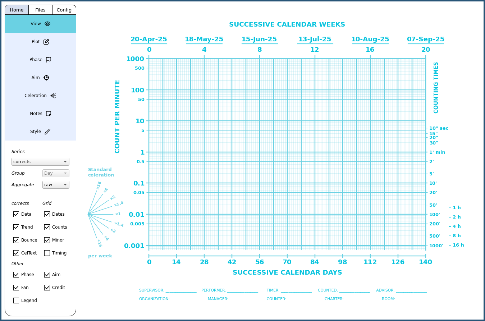

# iChart

iChart is a Python implementation of the Standard Celeration Chart (SCC). The SCC is a versatile data visualization tool used in the field of Precision Teaching and other areas for analysis of frequencies. The project is currently in alpha. The goal is a free and easy to use app for charting on desktop.

Tutorial: https://www.youtube.com/playlist?list=PLAU5et__-B6GtW31wBmQDiassXqOXEa8p

Contact: ichart.wopak@simplelogin.com 

## Content
- [Download & Installation](#download--installation)
- [Import Formatting](#import-formatting)
- [Images](#images)

## Features
- Data import and export
- Direct data entry
- Phase lines
- Aim lines
- Celeration and bounce lines
- Selective visibility of chart objects
- Credit lines
- Dynamic start date
- Supports the entire family of standard celeration charts

## Download & Installation

The latest version 0.4.0 can be [downloaded here](https://github.com/SJV-S/iChart/releases/tag/0.4.0). Extract content in your preferred directory. Launch by running iChart executable.

#### FAQ
- “Which file(s) should I download?” To run the app, you only need one file with the name of your operating system. Ignore the source code files.
- “Which version do I need?” Packages on older versions should work on newer versions, but not the reverse. For example, the Windows 10 version should work on 11, the Ventura version should work on Sonoma, and so on.

#### Mac

Once downloaded, double click on the zip file to extract it, then right click on the extracted file, and select “Open”. Your system will then ask you to grant the app [permission](https://support.apple.com/guide/mac-help/open-a-mac-app-from-an-unidentified-developer-mh40616/mac) to run. After that you should just be able to launch the app by double clicking like any other app

#### Windows

Windows is very paternalistic. Before running the app (to prevent Windows from deleting the file without asking) you need to *either*:
- Option 1: Turn off [real-time protection](https://support.microsoft.com/en-us/windows/turn-off-defender-antivirus-protection-in-windows-security-99e6004f-c54c-8509-773c-a4d776b77960).
- Option 2: This is probably the better one. Add an [exclusion](https://support.microsoft.com/en-us/windows/add-an-exclusion-to-windows-security-811816c0-4dfd-af4a-47e4-c301afe13b26) to the folder where you will be running iChart. Click [here](https://youtu.be/1r93NtwZt4o) to see how to do it on Windows 10, or [here](https://youtu.be/j2XGZCLL-Is) for Windows 11.

When running the app the first time, right click and select "Run as administrator". Windows Defender might raise a warning. To proceed, click on "More info" and then click "Run anyway".

#### Linux

Make the AppImage executable by right clicking, going into Properties, and check the "Allow file to run as program" in the Permissions tab (exact wording may vary). Or, run "chmod +x iChart-linux-x86_64.AppImage" in the terminal. Do not place the AppImage in privileged directories.

If the AppImage does not run, ensure that FUSE is installed.
- Ubuntu/Debian: sudo apt install fuse
- Fedora: sudo dnf install fuse
- openSUSE: sudo zypper install fuse
- Arch: sudo pacman -S fuse

## Import Formatting

You can import data from csv, xls, xlsx, and ods, files. iChart will only look at sheet 1 if you have multiple sheets, and only the first 6 columns. All subsequent columns will be ignored. You can use these extra columns for notes and other stuff. iChart will also only look at the first letter and ignore case when determining the data type. Additional letters can be added for human readabiliy. Column order does not matter. Here is an [example.](https://github.com/SJV-S/iChart/blob/main/example_data.csv)

1) *Date column*. Any column name starting with "d" will be interpreted as the date column. This column must contain full dates – day, month, and year. iChart should be quite flexible with exactly how the dates are formatted in the column, provided they are complete dates. If you still get import errors or strange date behaviors, try this format: yyyy-mm-dd (for instance, 2024-04-19). Values for duplicate dates will be summed together.
2) *Dot column*. Any column name starting with "c" (corrects) are interpreted as the dot column. These are expected to be raw counts. This column will automatically be padded with zero values if omitted.
3) *X column*. Any column name starting with "i" (incorrects) are interpreted as the x column. These are expected to be raw counts. This column will automatically be padded with zero values if omitted.
4) *Time column*. Any column starting with "s", "m" or "h" (seconds, minutes, hours) will be interpreted as part of the timing floor. They will be added up in the background as the total amount of minutes, and automatically used for obtaing frequency counts. You can omit all these columns if you are not using the minute charts. For minute charts, you can use them in any combination. For example, only use the "m" and "s" column and everything will be converted to minutes.

## Images

