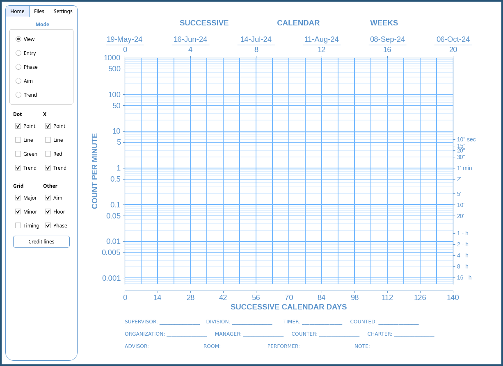
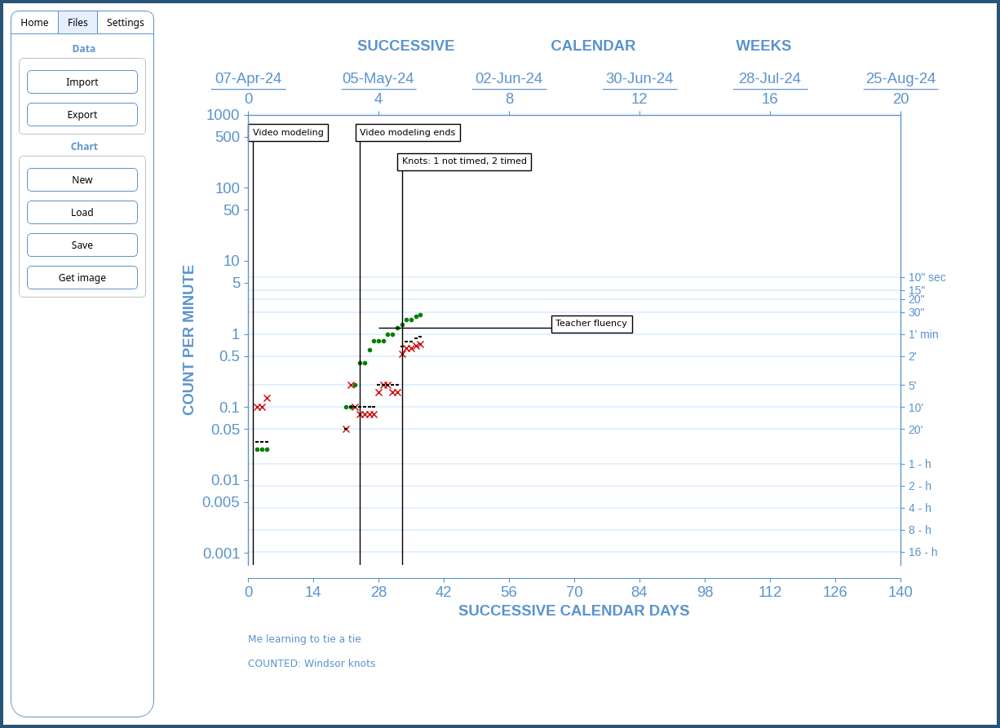

# iChart

A Python implementation of the Standard Celeration Chart (SCC). The SCC is a versatile data visualization tool used in the field of Precision Teaching for analysis of response frequencies. Currently in alpha. The goal is a free and easy to use app for charting on desktop.

Contact: ichart.wopak@simplelogin.com 

## Instructions
- [Installation](#installation)
- [Import Formatting](#import-formatting)

## Features
- Data import and export
- Direct data entry
- Phase lines
- Aim lines
- Trend analysis
- Selective viewing
- Credit lines
- Changeable start date

## Installation

Extract content in your preferred directory. Launch by running iChart executable.

On Windows, right click and select "Run as administrator". Windows Defender will then raise a warning. To proceed, click on "More info" and then click "Run anyway". In the unlikely event that this does not work, you may need to manually add an [exception.]([https://support.microsoft.com/en-us/windows/add-an-exclusion-to-windows-security-811816c0-4dfd-af4a-47e4-c301afe13b26#:~:text=Go%20to%20Start%20%3E%20Settings%20%3E%20Update,%2C%20file%20types%2C%20or%20process](https://github.com/SJV-S/iChart/blob/main/example_data.csv))

## Import Formatting

Here are some useful things to know when importing raw data, using the "Import" button. You can import from csv, xls, xlsx, and ods files. iChart will only look at the sheet 1 if you have multiple sheets. It will also only look at the first 4 columns in the sheet. All other columns will be ignored. You can use these extra columns for notes and other stuff. iChart will only look at the first letter and ignore case when determining the data type. Subsequent letters can be added for human readabiliy. The order in which you had the columns does not matter either.

1) Date column. Any column name starting with "d" will be interpreted as the date column. This column must contain full dates: day, month, and year.
2) Dot column. Any column name starting with "c", "a", or "r" (corrects, accurate, right) are interpreted as the dot column. These are expected to be raw counts.
3) X column. Any column name starting with "i", "e", or "w" (inaccurate, error, wrong) are interpreted as the dot column. These are expected to be raw counts.
4) Minutes column. Any column starting with "m" will be interpreted as the timing floor column. This will also be used in the background to obtain frequency counts. All values are assumed to be specifically minutes. You can omit this column if you are not using the minute charts.

Here is an [example.](https://github.com/SJV-S/iChart/blob/main/example_data.csv)

