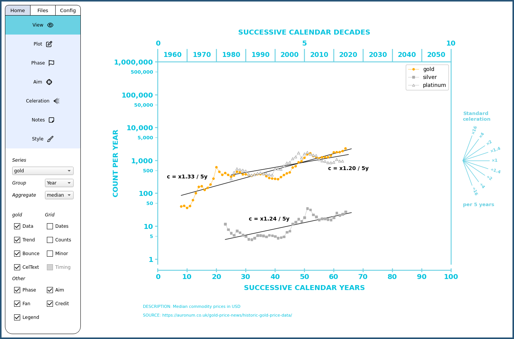

# OpenCelerator

OpenCelerator (formerly named iChart) is an open-source Python implementation of the Standard Celeration Chart (SCC). The SCC is a versatile data visualization tool used in the field of Precision Teaching and other areas for analysis of frequencies. The project is currently in alpha. If something is not working, let me know! The goal is a free and easy to use app for charting on desktop.

Tutorial: [Playlist](https://www.youtube.com/playlist?list=PLAU5et__-B6HCHmlgyxgPPDJ2rHgZ1PY4) (Outdated. I need to make a new one) <br>
About me: [LinkedIn](https://www.linkedin.com/in/jsv01/)<br>
YouTube: [Channel](https://www.youtube.com/@sudorandom7619)<br>
Contact: opencelerator.9qpel@simplelogin.com

"What is Precision Teaching?" Here is an excellent [intro](https://www.youtube.com/watch?v=PjwWZP726Ko&list=PLuQRRtTr10Mm1QycJLUjowBFugi7lg0c7&index=5&t=0s) by Carl Binder.


## Content
- [Download & Installation](#download--installation)
- [Images](#images)
- [Support the developer](#Support-the-developer)

## Features
- Phase lines
- Aim lines
- Celeration and bounce lines
- Selective visibility of chart objects
- Credit lines
- Dynamic start date
- Selective customization of data points
- Supports the entire family of standard celeration charts


## Download & Installation

The latest version 0.10.0 can be [downloaded here](https://github.com/SJV-S/OpenCelerator/releases/tag/0.10.0). Extract content in your preferred directory. Launch by running executable.

#### FAQ
- “Which file(s) should I download?” To run the app, you only need one single file with the name of your operating system. Normal users can ignore the source code and manifest files.
- "I am getting a scary warning when installing." This is normal and inevitable when running unregistered third-party apps. The only way to avoid this is by purchasing a security certificate. That would cost a lot of time and money, and is unnecessary when the code is open-source. I am also transparent about my identity in the "About me" link above.


#### Mac
How to run on Sequoia: [video](https://www.youtube.com/watch?v=scdAMJDGJvA)

#### Windows

How to run on Windows 10 and 11: [video](https://youtu.be/u8ugPqEv8LM)

#### Linux

OpenCelerator is available as an AppImage and Flatpak, so FUSE or Flatpak need to be installed. If using the AppImage, do not place it in privileged directories. Tahoma is the default font on Windows and Mac, so consider installing Tahoma if you want the exact same chart appearance as the majority of users. Otherwise, DejaVu Sans is the fallback – which is likely fine in most cases.

_AppImage_
```
sudo apt install libfuse2
```
```
sudo dnf install fuse-libs
```
_Flatpak_
```
sudo apt install flatpak
```
```
sudo dnf install flatpak
```
```
flatpak install --user OpenCelerator.flatpak
```

## Images




## Support the developer

**OpenCelerator will forever remain free and open-source**

About half a year's work has gone into this project. There is no team or funding behind it. Just me. If you find the app useful and would like to see its development continue, please consider donating.

PayPal: https://paypal.me/devpigeon<br>
Patreon: https://www.patreon.com/johanpigeon/membership<br>
Bitcoin (base chain): bc1qg8y5pxv5g86mhj59xdk89r6tr70zdw6rh6rwh4<br>
Bitcoin Lightning (LNURL): pigeon@getalby.com<br>

**Other ways to contribute**

- Provide feedback. Let me know what you like, what can be improved, report bugs, do testing, and so on. The software is still in alpha.
- Share this tool with others who might find it useful.
- If you use this in an official capacity, please acknowledge by linking to my GitHub: https://github.com/SJV-S/OpenCelerator

I am also looking for work! I have a PhD in behavior analysis and obviously know a little bit about coding. Will share CV upon request.<br>


