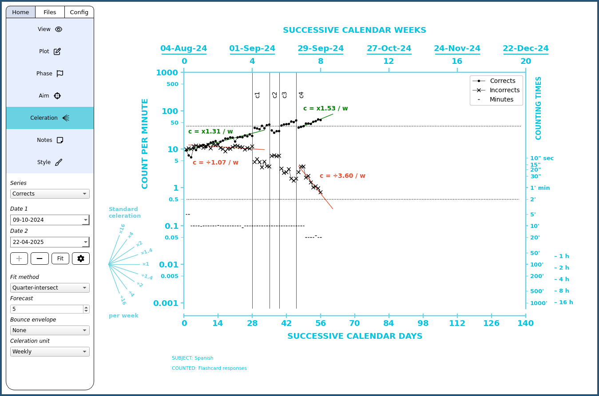

# OpenCelerator

OpenCelerator (formerly named iChart) is an open-source Python implementation of the Standard Celeration Chart (SCC). The SCC is a versatile data visualization tool used in the field of Precision Teaching and other areas for analysis of frequencies. The project is currently in alpha with new releases coming out on a regular basis. The goal is a free and easy to use app for charting on desktop.

Tutorial: [Playlist](https://www.youtube.com/playlist?list=PLAU5et__-B6HCHmlgyxgPPDJ2rHgZ1PY4) 
About me: [LinkedIn](https://www.linkedin.com/in/jsv01/) 
YouTube: [Channel](https://www.youtube.com/@sudorandom7619) 
Contact: opencelerator.9qpel@simplelogin.com

"What is Precision Teaching?" Here is an excellent [intro](https://www.youtube.com/watch?v=PjwWZP726Ko&list=PLuQRRtTr10Mm1QycJLUjowBFugi7lg0c7&index=5&t=0s) by Carl Binder.

## Content
- [Download & Installation](#download--installation)
- [Import Formatting](#import-formatting)
- [Images](#images)
- [Support the project](#Support-the-project)

## Features
- Data import and export
- Direct data entry
- Phase lines
- Aim lines
- Celeration and bounce lines
- Selective visibility of chart objects
- Credit lines
- Dynamic start date
- Selective customization of data points
- Supports the entire family of standard celeration charts

## Download & Installation

The latest version 0.7.0 can be [downloaded here](https://github.com/SJV-S/OpenCelerator/releases/tag/0.7.0). Extract content in your preferred directory. Launch by running executable.

#### FAQ
- “Which file(s) should I download?” To run the app, you only need one file with the name of your operating system. Ignore the source code files.
- “Which version do I need?” Packages on older versions should work on newer versions, but not the reverse. For example, the Windows 10 version should work on 11, the Ventura version should work on Sonoma, and so on.
- "I am getting a scary warning when installing." This is normal and inevitable when running unregistered third-party apps. The only way to avoid this is by purchasing a security certificate. That would cost a lot of time and money, and is unnecessary when the code is open-source. I am also transparent about my identity. See the "About me" link above. Feel free to contact me if you have questions.

#### Mac

How to install on MacOS: [video](https://youtu.be/5srnnDgY0Cw)

#### Windows

How to install on Windows: [video](https://youtu.be/u8ugPqEv8LM)

#### Linux

These instructions assume the Linux user is a bit more technical than the average Windows or Mac user. That said, feel free to reach out if you have questions. OpenCelerator is available as an AppImage and Flatpak, so FUSE or Flatpak need to be installed. If using the AppImage, do not place it in privileged directories. Tahoma is used as the default font on Windows and Mac, so consider installing Tahoma if you want the exact same chart appearance as the majority of users. Otherwise, DejaVu Sans is the fallback, which is likely fine in most cases.

## Import Formatting

You can import data from csv, xls, xlsx, and ods, files. OpenCelerator will only look at sheet 1 if you have multiple sheets, and only the first 7 columns. All subsequent columns will be ignored. You can use these extra columns for notes and other stuff. OpenCelerator will also only look at the first letter and ignore case when determining the data type. Additional letters can be added for human readabiliy. Column order does not matter. Here is an [example.](https://github.com/SJV-S/OpenCelerator/blob/main/example_data.csv)

1) *Date column*. Any column name starting with "d" will be interpreted as the date column. This column must contain full dates – day, month, and year. OpenCelerator should be quite flexible with exactly how the dates are formatted in the column, provided they are complete dates. If you still get import errors or strange date behaviors, try this format: yyyy-mm-dd (for instance, 2024-04-19).
2) *Dot column*. Any column name starting with "c" (corrects) are interpreted as the dot column. These are expected to be raw counts. This column will automatically be padded with zero values if omitted.
3) *X column*. Any column name starting with "i" (incorrects) are interpreted as the x column. These are expected to be raw counts. This column will automatically be padded with zero values if omitted.
4) *Time column*. Any column starting with "s", "m" or "h" (seconds, minutes, hours) will be interpreted as part of the timing floor. They will be added up in the background as the total amount of minutes, and automatically used for obtaing frequency counts. You can omit all these columns if you are not using the minute charts. For minute charts, you can use them in any combination. For example, only use the "m" and "s" column and everything will be converted to minutes.
5) By version 0.7.0, it will be possible to add a miscellaneous data category. Any column starting with “o” will be interpreted as this data type. Unlike the dot and x categories, misc data is not automatically divided by the timing floor (if used). It is not possible to place celeration lines on misc data either. However, the same kind of custom data styling options will be available.

## Images

## Support the project

**OpenCelerator will forever remain free and open-source**

About half a year's work has gone into this project. There is no team or funding behind it—just me. If you find the app useful and would like to see its development continue, please consider donating.

Patreon: https://www.patreon.com/johanpigeon/membership 
Bitcoin (base chain): bc1qg8y5pxv5g86mhj59xdk89r6tr70zdw6rh6rwh4 
Bitcoin Lightning (LNURL): pigeon@getalby.com 

**Other ways to contribute**

- **Provide feedback.** Let me know what you like, what can be improved, report bugs, do testing, and so on. The software is still in alpha.
- **Share this tool.** Share this tool with others who might find it useful.
- **Acknowledge.** If you use this in an official capacity, please acknowledge by linking to this GitHub repository: https://github.com/SJV-S/OpenCelerator

I am also looking for work! I have a PhD in behavior analysis and obviously know a little bit about coding. Happy to relocate. Will share CV upon request. 

